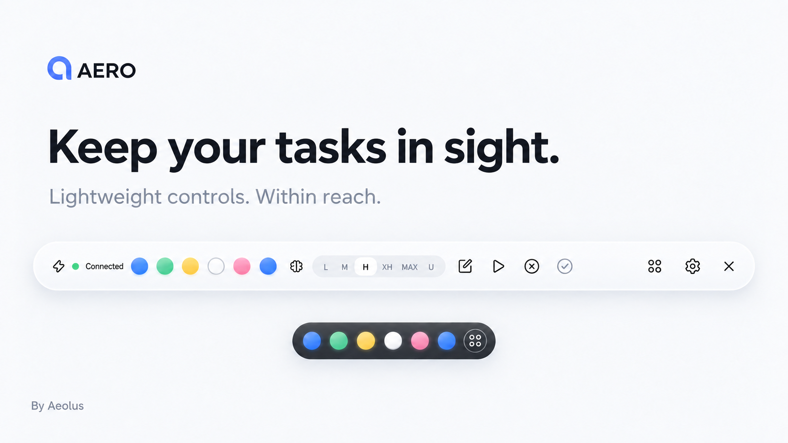
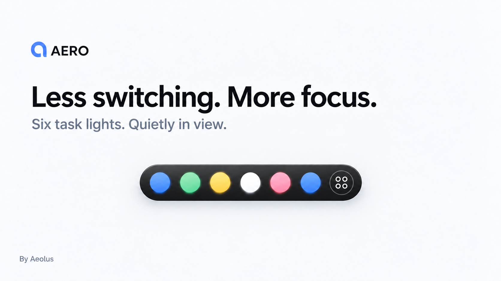
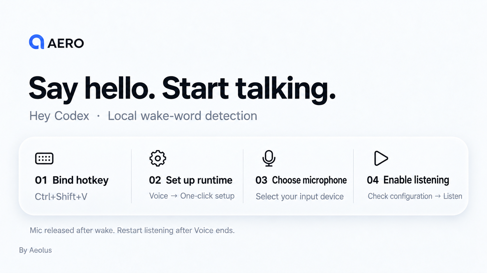

# AERO

[简体中文](README.md) · **English**

### Keep your tasks in sight. Keep your focus yours.

A calm, customizable Windows companion for Codex Desktop. **By Aeolus.**

[Get started](#get-started) · [User guide](docs/USAGE.en.md) · [Developer guide](docs/DEVELOPMENT.en.md) · [Report an issue](https://github.com/AeolusV/AERO/issues) · [License](LICENSE)



> Campaign visuals are AI-assisted illustrations based on the current interface. Refer to the actual component screenshots below for controls and behavior.

AERO puts Codex task status and everyday controls in a lightweight floating desktop bar. Keep designing, writing or browsing while seeing what is running, what has finished and what needs your attention. When needed, click a light to return to its thread.


> Component screenshots use fictional tasks and demonstration states, not private conversations or workspace data. This page and the user and developer guides are bilingual; the application interface is currently in Chinese.

## Less switching. More focus.



The **full bar** brings task status, reasoning effort, new-task, continue and interrupt controls to your desktop. Hide or drag to reorder controls and keep only what you need.

The **mini bar** keeps six task lights and a return button. Drag it freely or snap it to a screen edge. Collapse the full bar with one click to keep tasks quietly in view while working on something else.

<p align="center">
  
</p>

Hover to see the workspace and thread names; click a light to open its Codex task. An optional gentle sound marks the transition from working to complete.

## Task status at a glance

Color communicates task changes without constantly competing for attention. Both bars share the same status meanings, and you can customize the palette in settings.

| Status | Default color | Meaning |
| --- | --- | --- |
| Idle | White | No work is currently in progress |
| Thinking | Blue | Codex is working on a task |
| Complete | Green | Work is complete and ready to review |
| Needs input | Yellow | A reply or approval decision is needed |
| Error | Pink | Something went wrong and needs attention |

## Make it yours

Rounded edges, soft shadows, restrained translucency and smooth nonlinear transitions make AERO feel like a small desktop tool, not another window to manage.

- Choose light or dark appearances independently for each bar; settings follow the full-bar theme.
- Drag to reorder controls, choose what is visible and adjust interface density.
- Customize task lights with color presets and hex values.
- Choose Air, Mint, Sunset or Mono branding, a transparent logo background, or hide the logo.
- Turn interaction sounds off. Hide the window to the system tray; its menu offers show, voice and exit actions.


## Everyday controls, within reach

Open or switch tasks, create tasks, continue or interrupt work and adjust reasoning effort. Optional controls include branching, archiving, copying Markdown, opening the working folder and opening a terminal.

Available effort levels follow the capabilities published by the Codex model, including `Max` and `Ultra` when supported. Approve and deny act only on a specific request currently received by AERO; there is no cross-thread “approve everything” control.

## “Hey Codex”: local wake-up



Optional offline listening uses Vosk and your computer's microphone. On detecting the wake phrase, the listener releases the microphone first, then sends `Ctrl+Shift+V` to hand voice input over to Codex Desktop.


### Set up listening

1. **Bind the hotkey:** explicitly bind Voice to `Ctrl+Shift+V` in Codex Desktop's shortcut settings. AERO checks the binding; it does not change it for you.
2. **Set up the runtime:** open AERO Settings → Voice (`设置 → 语音`) and select One-click setup (`一键配置`). Wait for the runtime and English model to be ready. You can also select an existing Python executable and an extracted Vosk model folder.
3. **Choose the microphone:** select your actual input device, keep the wake phrase as `Hey Codex` and click Check configuration (`检查配置`). Do not reuse another computer's device index.
4. **Enable and try it:** turn on Listen (`监听`), confirm Listening (`监听中`) and say `Hey Codex`. A passed configuration check is not an end-to-end voice test; observe whether Codex Voice actually opens.

Closing the floating window hides it to the tray and leaves an enabled listener running. Turning listening off or exiting AERO from the tray stops it. After a successful wake, the listener releases the microphone and exits. Once Voice ends, click Restart listening (`重新监听`) in voice settings.

**Manual voice entry:** if you do not want continuous listening, turn it off and use the bar's voice button or the tray's voice menu to try opening Voice.

If nothing happens, check the hotkey binding, microphone, runtime and model paths, then open the log from voice settings. See the [user guide](docs/USAGE.en.md#optional-local-voice-wake-up) for details.

- Local wake-word detection makes no OpenAI API calls, uploads no audio and consumes no Codex tokens or cloud voice quota. **Codex Voice itself remains subject to Codex's usage rules and limits.**
- Settings offer microphone selection, a wake phrase, status, logs and one-click setup of an isolated Python runtime and English model. Initial setup downloads require internet access; subsequent recognition runs locally.
- Raw audio and routine transcripts are not saved by default. Disabling listening or exiting AERO ends the listener process.
- Bind Voice to `Ctrl+Shift+V` explicitly in Codex settings. AERO checks but does not modify Codex settings.
- The listener stays stopped after wake-up. Resume manually after Voice ends; automatic session-end detection is not implemented.

## Get started

Currently available as source; there is no installer. You need Windows, Node.js 24 LTS, npm and an installed, signed-in Codex Desktop.

Read the licensing section below before obtaining or using the source within the applicable authorization scope.

```powershell
git clone https://github.com/AeolusV/AERO.git
Set-Location AERO
npm.cmd ci
npm.cmd run build
npm.cmd start
```

Development mode:

```powershell
npm.cmd run dev
```

AERO discovers the local Codex backend on startup. Open settings to choose controls, appearance and optional voice features. Voice wake-up is not required to use task status lights.

See the [user guide](docs/USAGE.en.md) for operation and troubleshooting, and the [developer guide](docs/DEVELOPMENT.en.md) before changing code. `npm.cmd run verify` runs offline regression tests, type checks and a build without starting microphone listening or a real Codex session.

## Compatibility and boundaries

AERO is an independent project. It does not modify the Codex installation, depend on the hidden Codex Micro settings page or represent an official OpenAI product.

- The verified Desktop version is `26.928.3736.0`. AERO uses the experimental `app-server` protocol; Codex updates may require adaptations.
- Task status combines backend metadata and local structured events. It is not a direct mirror of Desktop's internal state and may refresh with a delay.
- Effort choices currently follow the default model. When Desktop exclusively owns a task, a change may fall back to the default configuration for later submissions rather than updating the current composer.
- Remote pairing belongs to Codex's experimental interfaces; it is not a smart-home connection. AERO currently offers no smart-home control.
- Successfully sending the voice hotkey does not prove a Voice session has started. Desktop must support Voice and be able to receive the shortcut.

When reporting an [issue](https://github.com/AeolusV/AERO/issues), include Windows and Codex versions, reproduction steps and expected behavior. Do not upload credentials, private conversations or sensitive logs.

## Author and licensing

**Aeolus** · Copyright © 2026 Aeolus.

This project is **source available, with author authorization required**, not permissively licensed open source. Copying, distributing or modifying original AERO content requires prior, explicit written permission from Aeolus, except for acts already authorized by law or the hosting platform. Attribution is not a substitute for permission.

Request authorization through [GitHub Discussions](https://github.com/AeolusV/AERO/discussions), describing your intended use and scope. See [LICENSE](LICENSE) and [third-party notices](THIRD_PARTY_NOTICES.md).
