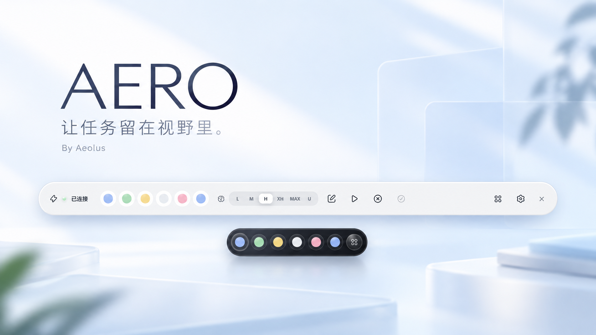
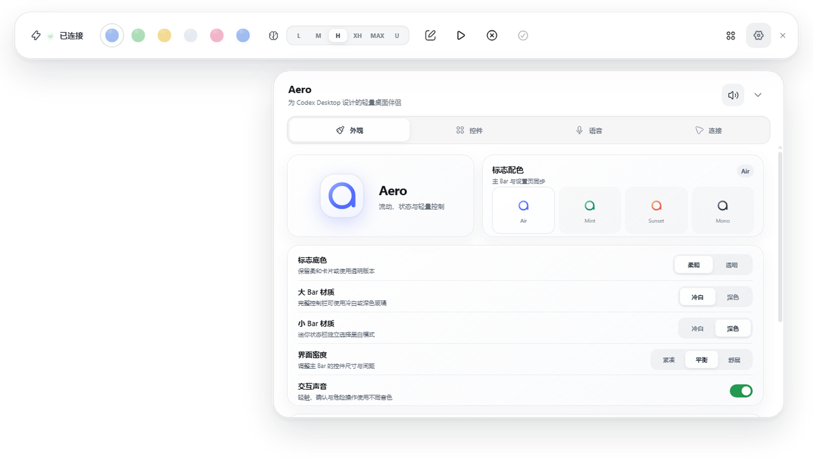
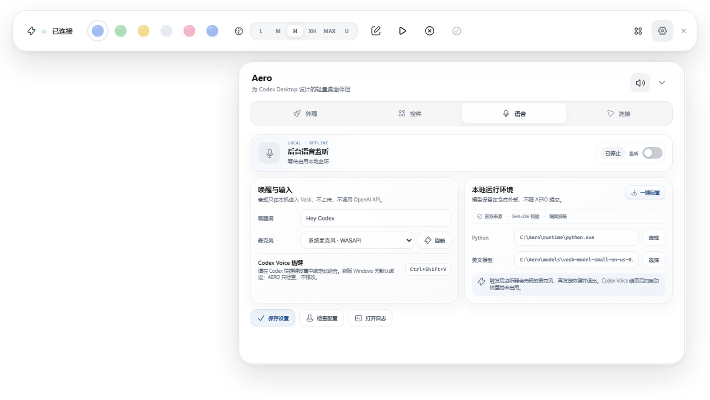

# AERO

**简体中文** · [English](README.en.md)

### 让任务留在视野里，让专注回到你手上。

为 Codex Desktop 而作的轻盈桌面伴侣。**By Aeolus.**

[开始使用](#开始使用) · [使用指南](docs/USAGE.md) · [开发指南](docs/DEVELOPMENT.md) · [反馈](https://github.com/AeolusV/AERO/issues) · [授权](LICENSE)



AERO 让你不必反复切回 Codex，也能知道任务进行到了哪里。

继续设计、写作，或浏览下一份资料。正在运行、已经完成、需要回应——一条轻盈的悬浮栏，把这些变化留在视野里。需要你时，点一下，就回到对应的任务。


## 少一点切换，多一点专注


**需要掌控时，展开。** 查看任务、调整推理强度，或开始、继续、中断工作。把常用操作放在手边，其余控件随时隐藏。

**需要专注时，收起。** 六个任务灯，一个返回按钮。拖到喜欢的位置，或轻轻靠在屏幕边缘；一键展开，随时回到完整控制栏。

<p align="center">
  
</p>

悬停，看清工作区和任务名称。点击，回到那段对话。任务完成时，一声可选的轻柔提示，让你不用一直守着屏幕。

## 一眼读懂任务状态

一盏灯，一种状态。无论展开还是收起，颜色都表达同一件事。也可以换成你喜欢的色彩，让它更自然地融入桌面。

| 状态 | 默认颜色 | 含义 |
| --- | --- | --- |
| 空闲 · Idle | 白色 | 暂时没有进行中的工作 |
| 运行 · Thinking | 蓝色 | Codex 正在处理任务 |
| 完成 · Complete | 绿色 | 工作完成，等你查看 |
| 需要输入 · Needs input | 黄色 | 需要你的回应或批准 |
| 错误 · Error | 粉色 | 遇到问题，需要关注 |

## 把控制栏变成你的样子

冷白，或深色。柔和的光感，轻盈的半透明，舒缓的展开与收起。AERO 留在桌面上，也为你的内容留出空间。

- 为完整栏和迷你栏分别选择明暗外观。
- 拖动排列控件，只留下你常用的部分，调整到舒服的大小。
- 从预设色板挑选灯色，或输入自己的颜色。
- 在 Air、Mint、Sunset、Mono 之间切换标志配色，也可以选择透明底色或隐藏标志。
- 喜欢安静，就关掉声音。暂时不需要，就藏到系统托盘。



## 常用操作，随手可达

从一个任务切到另一个任务，开始新的想法，继续未完成的工作。调整推理强度、分支与归档任务、复制 Markdown，或打开工作目录与终端——常用的动作，不必藏在层层窗口后面。

控件由你选择，顺序由你安排。推理档位随模型能力显示；需要批准时，只处理当前收到的具体请求。

## 一句唤醒，回到对话


有时，说出来比打出来更自然。

开启本地唤醒，说一句 **“Hey Codex”**，让 AERO 为你呼出 Codex Voice。也可以不启用持续监听，直接点击控制栏或托盘中的语音按钮。

唤醒识别在你的电脑上完成，不上传音频，不调用 OpenAI API，也不消耗 Codex token 或云端语音额度。Codex Voice 则独立运行，遵循它自身的使用规则与额度。



在「设置 → 语音」中一键配置，选择麦克风，再开启监听。首次配置需要联网下载；之后的唤醒识别可离线运行。使用前，请在 Codex 中将 Voice 快捷键绑定为 `Ctrl+Shift+V`，AERO 不会替你修改。

唤醒后，AERO 会释放麦克风并停止监听，让 Codex Voice 接手。对话结束后，点击「重新监听」即可再次启用。隐藏到托盘不会停止监听；关闭监听开关或退出 AERO 才会停止。默认不保存原始音频或日常转写。

[查看语音配置指南](docs/USAGE.md#可选本地语音唤醒)

## 开始使用

AERO 面向 Windows，需要已安装并登录的 Codex Desktop。目前提供源码运行方式，尚无安装包；准备 Node.js 24 LTS 和 npm，并先阅读 [授权说明](LICENSE)。

```powershell
git clone https://github.com/AeolusV/AERO.git
Set-Location AERO
npm.cmd ci
npm.cmd run build
npm.cmd start
```

打开后，挑选喜欢的外观，把常用控件放到手边。语音唤醒是可选功能，不影响任务栏的日常使用。

[使用与常见问题](docs/USAGE.md) · [开发指南](docs/DEVELOPMENT.md)

<details>
<summary>使用前了解</summary>

- AERO 是独立项目，不代表 OpenAI 官方产品，也不修改 Codex 安装包。
- 已验证的 Codex Desktop 版本为 `26.928.3736.0`。Codex 更新可能影响连接或部分功能；任务状态偶尔会有刷新延迟。
- 推理档位以默认模型为准。部分情况下，选择只对后续提交生效，不会同步改变 Codex 当前输入框。
- 语音需要 Codex 支持 Voice 并能接收对应热键；发送快捷键不代表语音一定已打开。
- 当前不提供智能家居控制。
- 首页与指南提供中英文版本，应用界面目前为中文。
- 宣传图为 AI 辅助视觉；界面截图使用演示任务。实际外观与功能以应用为准。

遇到问题，欢迎通过 [Issues](https://github.com/AeolusV/AERO/issues) 反馈。请注明版本与遇到的情况，不要附带凭证、私密对话或敏感日志。

</details>

## By Aeolus

Copyright © 2026 Aeolus.

AERO 采用源码公开、作者授权模式，并非宽松开源许可。复制、分发或改写原创内容，须事先获得 Aeolus 明确书面授权；法律及托管平台已有授权的行为除外。署名不替代授权。

[联系作者申请授权](https://github.com/AeolusV/AERO/discussions) · [LICENSE](LICENSE) · [第三方内容说明](THIRD_PARTY_NOTICES.md)
